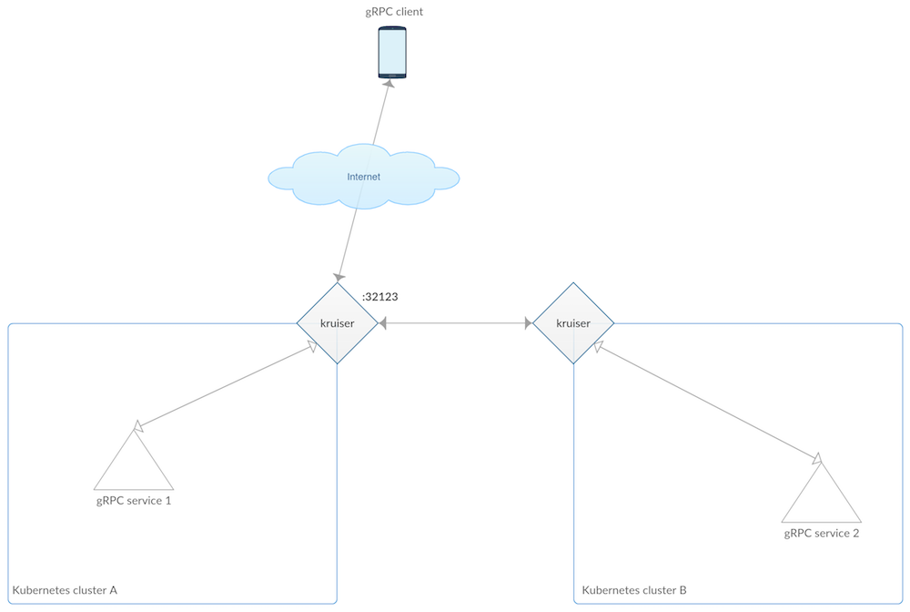

# Kruiser

A proxy that transparently exposes gRPC Kubernetes services cluster-externally.

Using [Ambassador](https://www.getambassador.io/) as gRPC proxy, `kruiser` 
watches services labelled with `grpc=expose` and proxies them to the public using a service of type NodePort on ports from `31000` upwards.



Note: so far tested on Minikube v0.24 and v0.25 with Kubernetes v1.8 and v1.9 as well as on GKE with Kubernetes v1.9.


## Use cases

There are two main use cases:

### UC1: inter-cluster within the enterprise

### UC2: public services

## Install 

First, clone this repository with `git clone https://github.com/mhausenblas/kruiser.git && cd kruiser`.

Creating a namespaces for related apps rather than dumping all into the `default` namespace is a good practice, so let's do that first:

```bash
$ kubectl create namespace kruiser
```

## Use

### Example gRPC demo services

The two example gRPC [demo services/](demo-services/) used below here are:

- A simple echo service [yages.Echo](https://github.com/mhausenblas/yages/blob/master/main.go) available via `quay.io/mhausenblas/yages:0.1.0`
- The reference [helloworld.Greeter](https://github.com/grpc/grpc-go/blob/master/examples/helloworld/greeter_server/main.go) available via `quay.io/mhausenblas/grpc-gs:0.2`

As a generic gRPC client we use [fullstorydev/grpcurl](https://github.com/fullstorydev/grpcurl) which you can either install locally, if you have Go installed, or as a container via the [quay.io/mhausenblas/gump:0.1](https://quay.io/repository/mhausenblas/gump?tag=0.1&tab=tags) container image.


### Walkthroughs

In the following, I'll walk you through how you can use `kruiser` in a static manner, that is, manually exposing gRPC services cluster-externally. Along the way I explain how `kruiser` works.


```bash
$ kubectl create namespace kruiser
```

#### Minikube 

```bash
$ kubectl -n kruiser apply -f ambassador/admin.yaml
$ kubectl -n kruiser apply -f demo-services/
$ grpcurl --plaintext $(minikube ip):32123 helloworld.Greeter.SayHello
```

Alternatively, access a gRPC services via the gRPC jump pod like so:

```bash
$ kubectl -n kruiser run -it --rm gumpod --restart=Never \
                             --image=quay.io/mhausenblas/gump:0.1

/go $ grpcurl --plaintext ping:9000 yages.Echo.Ping
```

#### GKE

Note that the GKE deployment uses RBAC.

```bash
$ gcloud projects get-iam-policy $PROJECT_ID
$ kubectl apply -f ambassador/gke-crb.yaml
$ kubectl describe clusterrolebinding makesmeclusteradmin

$ kubectl -n kruiser apply -f ambassador/admin-rbac.yaml
$ kubectl -n kruiser apply -f demo-services/
$ grpcurl --plaintext $(minikube ip):32123 helloworld.Greeter.SayHello
```

#### Cleanup

When done, clean up with:

```bash
$ kubectl delete ns kruiser
```
